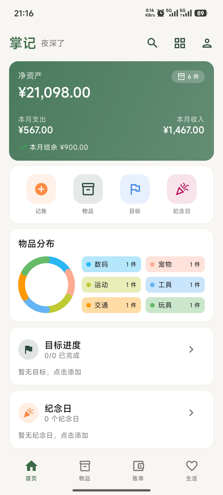
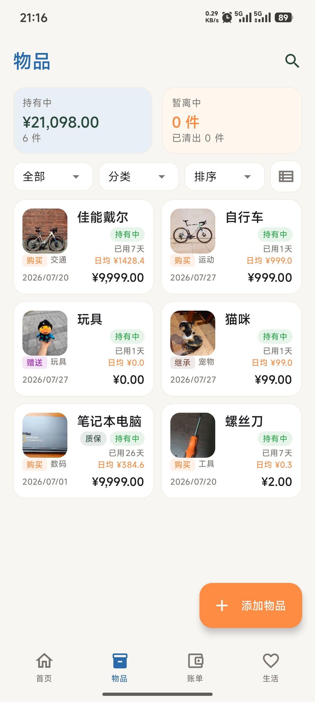
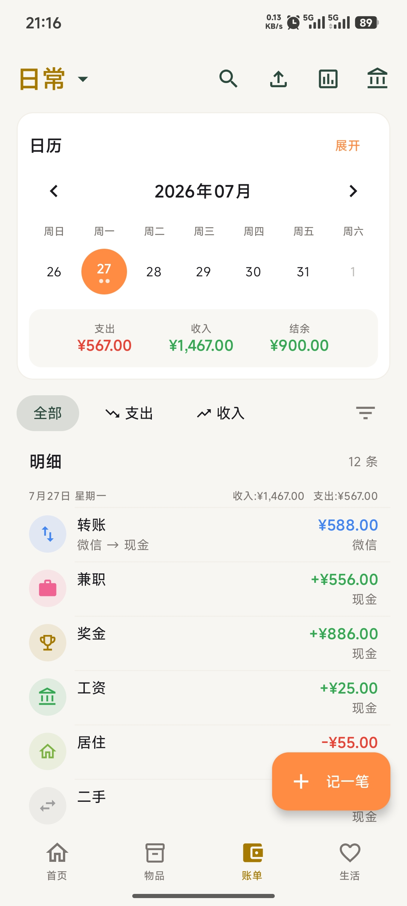
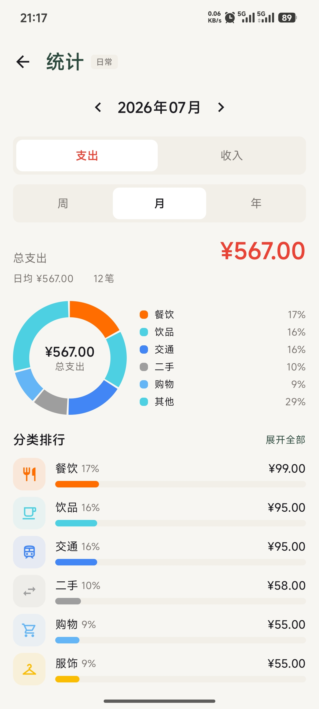
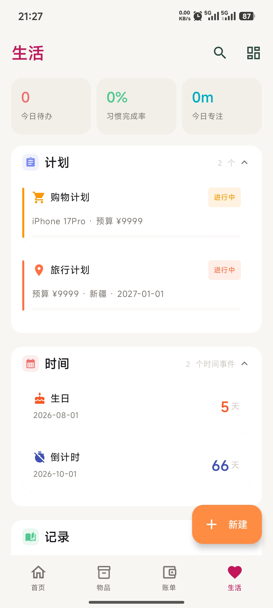
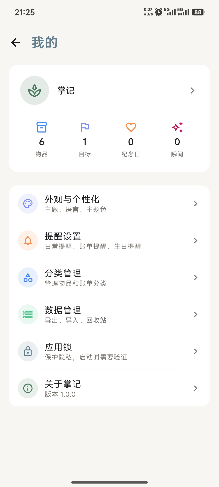

# PalmNote 掌记

> **中文** | [English](README.en.md)

[](LICENSE)


[](https://github.com/PickGear/PalmNote/releases)
[](https://github.com/PickGear/PalmNote/actions/workflows/ci.yml)

> **⚠️ 声明：** PalmNote 正在活跃开发中，可能存在问题和未完善的功能，欢迎反馈与建议！

一款**纯本地优先**的生活记录应用，集成记账、资产管理、生活规划与记录、密码本于一体。无需注册，数据全部存储于本地，无需联网即可使用全部功能。

## 截图

<table>
  <tr>
    <td align="center"><b>首页</b></td>
    <td align="center"><b>物品管理</b></td>
    <td align="center"><b>记账</b></td>
  </tr>
  <tr>
    <td></td>
    <td></td>
    <td></td>
  </tr>
  <tr>
    <td align="center"><b>统计报表</b></td>
    <td align="center"><b>生活模块</b></td>
    <td align="center"><b>设置</b></td>
  </tr>
  <tr>
    <td></td>
    <td></td>
    <td></td>
  </tr>
</table>

## 下载

[](https://github.com/PickGear/PalmNote/releases/latest)

从 [Releases](https://github.com/PickGear/PalmNote/releases) 下载最新 APK，或自行构建。

## 更新日志

详见 [CHANGELOG.md](CHANGELOG.md)。

## 功能特性

### 🏠 首页 Dashboard
- 净资产、月度收支概览
- 预算提醒、目标进度、纪念日倒计时
- 卡片拖拽排序、自定义显隐

### 📦 物品管理
- 物品录入、分类、状态追踪（持有/闲置/已出/丢失/退役）
- 使用记录、日均成本计算
- 保修/保险/维护提醒
- 关联账单、图片附件

### 💰 记账
- 多账本、多钱包管理
- 收支分类、预算设置、月度/年度报表
- 日历视图、高级筛选
- CSV/XLSX 导入、OCR 识别
- 桌面小组件

### 🌿 生活模块
- **计划类**：存钱计划、购物清单、旅行规划、阅读计划、学习计划、待办任务
- **时间类**：倒计时、正数日、生日、纪念日
- **记录类**：习惯打卡（热力图）、心情记录（日历+趋势图）、日记、专注计时、订阅管理、周报月报
- **通用能力**：自定义模板、跨模块关联、成就徽章

### 🔑 密码本
- 纯离线密码管理：标题/用户名/密码/网址/备注/分类
- 密码生成器（长度与字符集可配、熵强度提示）
- 搜索、分类筛选、密码遮罩查看、一键复制（30 秒自动清除剪贴板）
- 独立主密码，字段级 AES-256-GCM 加密，切后台立即锁定

### 🔒 安全
- 应用锁（PIN + 生物识别，PBKDF2 加密）
- SQLCipher 全库加密（AES-256）
- 密码本字段级 AES-GCM 加密 + 密钥包裹
- AES-GCM 加密备份
- 纯本地存储，全部功能无需联网

## 技术栈

| 层 | 方案 |
|---|------|
| 语言 | Kotlin 2.2.20 |
| UI | Jetpack Compose + Material 3 |
| 数据库 | Room 2.7.2 |
| 偏好存储 | DataStore |
| 图片加载 | Coil 3 |
| 导航 | Navigation Compose |
| 图表 | Compose Canvas 自绘 |
| 依赖注入 | Hilt |
| 备份加密 | AES-GCM + PBKDF2 |
| 数据库加密 | SQLCipher |
| OCR | PaddleOCR PP-OCRv6（本地离线，ONNX Runtime） |
| 后台任务 | WorkManager |
| 序列化 | Kotlinx Serialization |
| 农历 | Lunar |
| 生物识别 | AndroidX Biometric |
| 构建 | Gradle（AGP 8.13）+ Kotlin DSL |

## 架构

```
com.palmnote/
├── data/           # 数据层
│   ├── backup/     # 备份恢复
│   ├── datastore/  # DataStore 偏好
│   ├── db/         # Room DAO/Entity/迁移
│   ├── export/     # CSV/ZIP 导入导出
│   ├── lock/       # 应用锁加密
│   ├── ocr/        # PaddleOCR 识别（ppocr-sdk）
│   ├── repository/ # Repository 实现
│   ├── sync/       # 日历同步
│   └── worker/     # WorkManager 后台任务
├── domain/         # 领域层
│   ├── model/      # 领域模型
│   ├── repository/ # Repository 接口
│   ├── service/    # 业务服务
│   └── util/       # 工具类（DateUtils/CurrencyUtils）
├── feature/        # 独立功能模块
│   └── vault/      # 密码本（字段级加密）
├── di/             # Hilt 依赖注入
├── ui/             # 表现层：按模块分包
│   ├── asset/      # 物品模块
│   ├── bills/      # 记账模块
│   ├── dashboard/  # 首页
│   ├── life/       # 生活模块（plan/time/record）
│   ├── settings/   # 设置
│   ├── search/     # 搜索
│   ├── lock/       # 应用锁
│   ├── widget/     # 桌面小组件
│   ├── navigation/ # 导航
│   ├── backup/     # 备份页面
│   ├── components/ # 通用组件
│   └── theme/      # 主题（Color/Shape/Type/Icon）
└── PalmNoteApp.kt  # Application
```

## 构建

```bash
# 克隆项目
git clone https://github.com/PickGear/PalmNote.git

# 打开 Android Studio 或命令行构建
./gradlew assembleDebug
```

**环境要求：**
- Android Studio（支持 AGP 8.13）
- JDK 17
- compileSdk 36 / targetSdk 34（自用/侧载；上架时按需升回）

## 设计规范

- 全局设计系统（色彩、字体、间距、组件、动画）：[docs/design-spec.md](docs/design-spec.md)
- 密码本模块设计：[docs/feature-vault.md](docs/feature-vault.md)

## 隐私与条款

- [隐私政策](docs/privacy/privacy-zh.md)
- [用户协议](docs/terms/terms-zh.md)

## 如何贡献

欢迎提交 Bug、功能建议与代码：

- 提交 Bug 或功能请求 → [Issues](https://github.com/PickGear/PalmNote/issues)
- 提交代码 → [Pull Requests](https://github.com/PickGear/PalmNote/pulls)
- 贡献指南 → [CONTRIBUTING.md](CONTRIBUTING.md)
- 安全漏洞报告 → [SECURITY.md](SECURITY.md)
- 社区行为准则 → [CODE_OF_CONDUCT.md](CODE_OF_CONDUCT.md)

## 开源协议

本项目基于 [GPL-3.0](LICENSE) 许可证发布。第三方组件及依赖的版权与许可证声明见 [NOTICE](NOTICE)。

## 联系方式

- GitHub Issues：https://github.com/PickGear/PalmNote/issues
