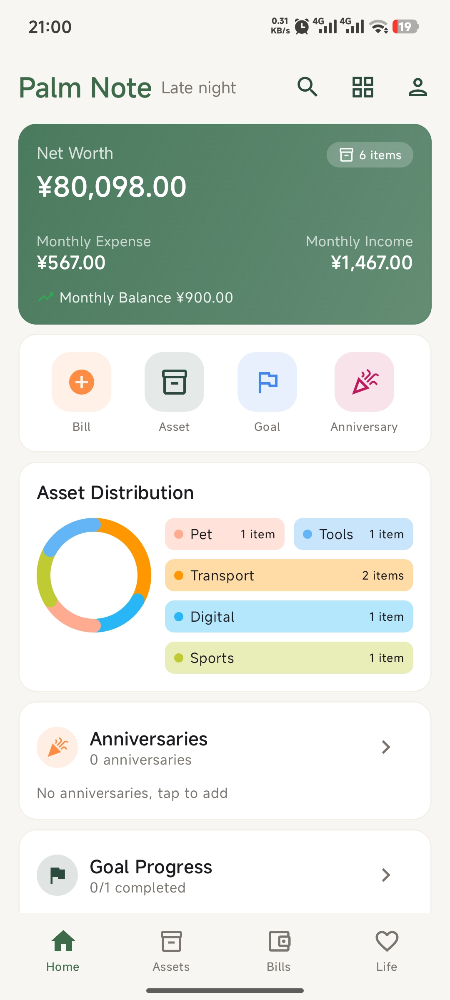
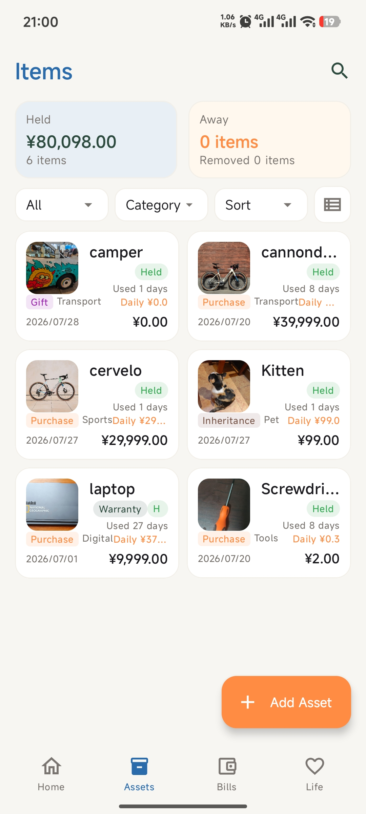
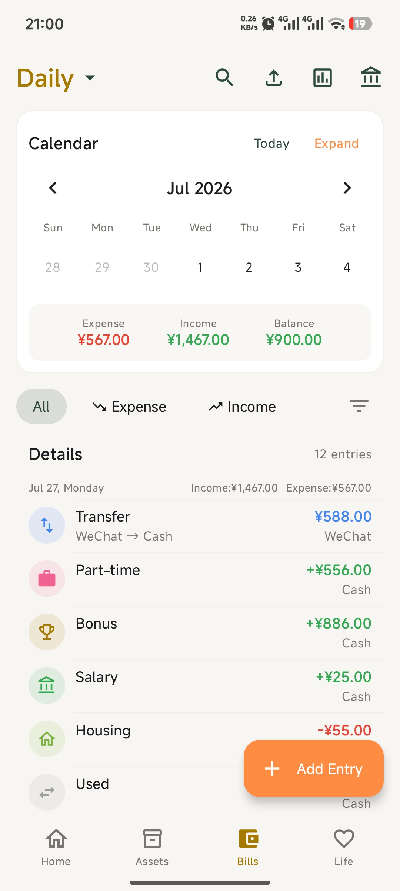
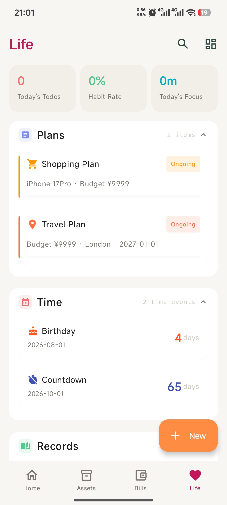
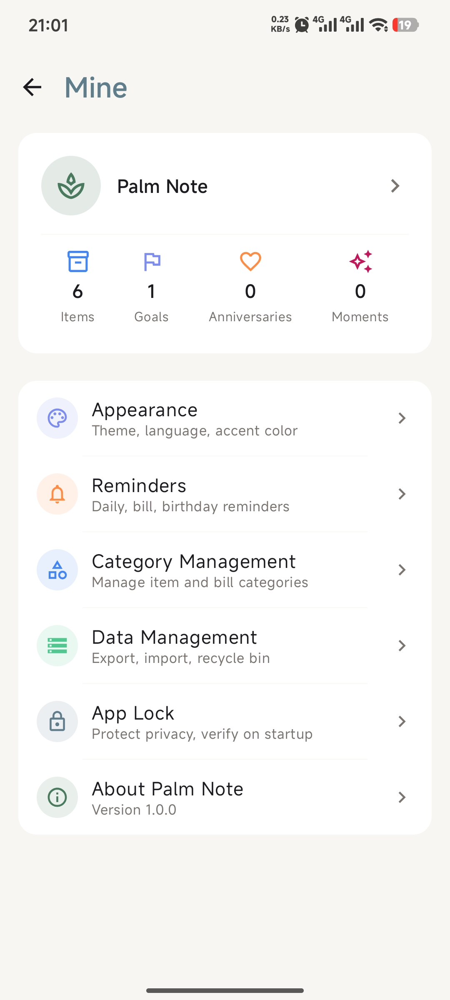
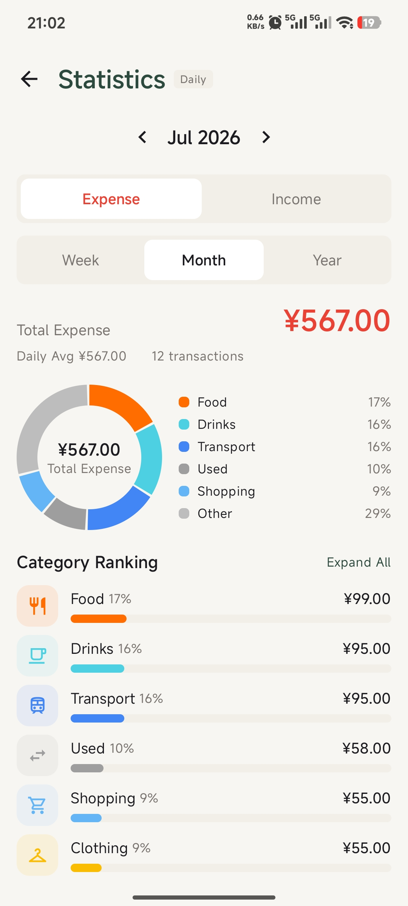

# PalmNote

> **English** | [中文](README.zh-CN.md)

[](LICENSE)


[](https://github.com/PickGear/PalmNote/releases)
[](https://github.com/PickGear/PalmNote/actions/workflows/ci.yml)

> **⚠️ Disclaimer:** PalmNote is under active development. You may encounter bugs or incomplete features. Feedback and contributions are welcome!

A fully local-first life tracking tool that combines expense tracking, asset management, and life planning into one app. No registration required — your data is stored locally, all features work offline.

## Screenshots

<table>
  <tr>
    <td align="center"><b>Dashboard</b></td>
    <td align="center"><b>Assets</b></td>
    <td align="center"><b>Bills</b></td>
  </tr>
  <tr>
    <td></td>
    <td></td>
    <td></td>
  </tr>
  <tr>
    <td align="center"><b>Reports</b></td>
    <td align="center"><b>Life</b></td>
    <td align="center"><b>Settings</b></td>
  </tr>
  <tr>
    <td></td>
    <td></td>
    <td></td>
  </tr>
</table>

## Download

[](https://github.com/PickGear/PalmNote/releases/latest)

Grab the latest APK from [Releases](https://github.com/PickGear/PalmNote/releases), or build it yourself.

## Changelog

See [CHANGELOG.md](CHANGELOG.md).

## Features

### 🏠 Dashboard
- Net worth, monthly income/expense overview
- Budget reminders, goal progress, anniversary countdowns
- Drag-and-drop card reordering, show/hide customization

### 📦 Asset Management
- Item logging, categorization, status tracking (owned/idle/sold/lost/retired)
- Usage records, daily average cost calculation
- Warranty/insurance/maintenance reminders
- Linked bills and image attachments

### 💰 Expense Tracking
- Multi-ledger, multi-wallet management
- Income/expense categories, budget settings, monthly/yearly reports
- Calendar view, advanced filtering
- CSV/XLSX import, OCR recognition
- Home screen widget

### 🌿 Life Module
- **Plans**: Savings goals, shopping lists, travel plans, reading lists, study plans, to-do tasks
- **Time**: Countdowns, day counters, birthdays, anniversaries
- **Records**: Habit tracking (heatmap), mood journal (calendar + trend chart), diary, focus timer, subscription management, weekly/monthly reports
- **Cross-module**: Custom templates, cross-module linking, achievement badges

### 🔒 Security
- App lock (PIN + biometric, PBKDF2 hashing)
- AES-GCM encrypted backups
- 100% local storage, all features work offline

## Tech Stack

| Layer | Solution |
|-------|----------|
| Language | Kotlin 2.0.21 |
| UI | Jetpack Compose + Material 3 |
| Database | Room 2.6.1 |
| Preferences | DataStore |
| Images | Coil 3 |
| Navigation | Navigation Compose |
| Charts | Custom Canvas drawing |
| DI | Manual (AppContainer) |
| Backup Encryption | AES-GCM + PBKDF2 |
| OCR | ML Kit (on-device) |
| Background Tasks | WorkManager |
| Serialization | Kotlinx Serialization |
| Chinese Lunar Calendar | Lunar |
| Biometric | AndroidX Biometric |
| Build | Gradle + Kotlin DSL |

## Architecture

```
com.palmnote/
├── data/           # Data layer
│   ├── backup/     # Backup & restore
│   ├── datastore/  # DataStore preferences
│   ├── db/         # Room DAO/Entity
│   ├── export/     # CSV/ZIP import/export
│   ├── lock/       # App lock encryption
│   ├── ocr/        # ML Kit OCR
│   ├── repository/ # Repository implementations
│   ├── sync/       # Data sync
│   └── worker/     # WorkManager background tasks
├── domain/         # Domain layer
│   ├── model/      # Domain models
│   ├── repository/ # Repository interfaces
│   ├── service/    # Business services
│   └── util/       # Utilities (DateUtils/CurrencyUtils)
├── di/             # Dependency injection: AppContainer
├── ui/             # UI layer (per-module packages)
│   ├── asset/      # Asset management
│   ├── bills/      # Expense tracking
│   ├── dashboard/  # Home dashboard
│   ├── life/       # Life module (plan/time/record)
│   ├── settings/   # Settings
│   ├── search/     # Search
│   ├── lock/       # App lock screen
│   ├── widget/     # Home screen widget
│   ├── navigation/ # Navigation
│   ├── backup/     # Backup UI
│   ├── components/ # Shared components
│   └── theme/      # Theme (Color/Shape/Type/Icon)
└── PalmNoteApp.kt  # Application class
```

## Build

```bash
# Clone the repository
git clone https://github.com/PickGear/PalmNote.git

# Open in Android Studio or build from command line
./gradlew assembleDebug
```

**Requirements:**
- Android Studio Hedgehog or later
- JDK 17
- Android SDK 35
- Min SDK: 26 (Android 8.0)

## Design Spec

See [docs/design-spec.md](docs/design-spec.md) for the complete design system including colors, typography, spacing, components, and animations.

## Contributing

Contributions are welcome! See [CONTRIBUTING.md](CONTRIBUTING.md).

- Report bugs or request features → [Issues](https://github.com/PickGear/PalmNote/issues)
- Submit code → [Pull Requests](https://github.com/PickGear/PalmNote/pulls)

## License

This project is licensed under the [GPL-3.0](LICENSE) license.

## Contact

- GitHub Issues: https://github.com/PickGear/PalmNote/issues
